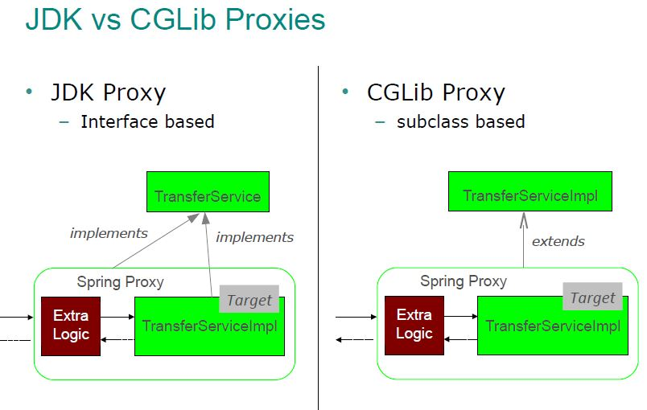
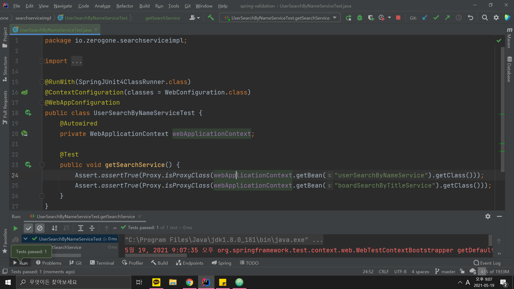

2021년에 들면서 새로운 프로젝트를 시작하였고,

나는 프로젝트를 조영호님의 "오브젝트"라는 좋은 책을 읽으면서 개발을 하고 있기 때문에

Spring MVC와 Layered Architecture에서

Service Layer를 **추상화를 통한 느슨한 결합**을 하고 싶어

검색, 생성 로직이 모델에 연관없이 비슷한 양상을

Java Generic을 이용하여 공통 부분을 interface로 추출하였다.

*당시 상황과 비슷한 예제*

```java
public interface SearchService<K, V> {
    V search(K key);
}
```
```Java
@Service
public class BoardSearchByTitleService implements SearchService<Title, BoardDto> {
    private final List<Board> boardList = Arrays.asList(new Board("Issue1"), new Board("Issue2"), new Board("Issue3"));

    @Override
    public BoardDto search(Title title) {
        Board targetBoard = boardList.stream()
                .filter(board -> Objects.equals(board.getTitle(), title.getValue()))
                .findAny()
                .orElseThrow(NotFoundException::new);

        BoardDto boardDto = new BoardDto();
        boardDto.setTitle(targetBoard.getTitle());
        return boardDto;
    }
}
```
```java
@Service
public class UserSearchByNameService implements SearchService<Name, UserDto> {
    private final List<User> users = Arrays.asList(new User("김영곤"), new User("양진민"));

    @Override
    public UserDto search(Name name) {
        User targetUser = users.stream()
                .filter(user -> Objects.equals(user.getName(), name.getValue()))
                .findAny()
                .orElseThrow(NotFoundException::new);

        UserDto userDto = new UserDto();
        userDto.setName(targetUser.getName());
        return userDto;
    }
}
```
```java
@RestController
public class UserSearchController {
    private final SearchService<Name, UserDto> searchService;

    public UserSearchController(SearchService<Name, UserDto> searchService) {
        this.searchService = searchService;
    }

    @GetMapping("users")
    public UserDto getUserDtoByName(@RequestParam Name name) {
        return searchService.search(name);
    }
}
```

그리고 요청마다 검증 로직을 추가하고 있을 때

Bean validation를 이용해서 유효성 검증을 간편하게 할 수 있다는 사실을 알게 되었다.

>>[Validation 어디까지 해봤니?](https://meetup.toast.com/posts/223)

포스팅을 보면서

```java
@EnableWebMvc
@Configuration
@ComponentScan(basePackages = "io.zerogone")
public class WebConfiguration extends WebMvcConfigurerAdapter {

    //etc

    @Bean
    public MethodValidationPostProcessor methodValidationPostProcessor() {
        return new MethodValidationPostProcessor();
    }
}
```
```java
@RestController
@Validated
public class UserSearchController {
    private final SearchService<Name, UserDto> searchService;

    public UserSearchController(SearchService<Name, UserDto> searchService) {
        this.searchService = searchService;
    }

    @GetMapping("users")
    public UserDto getUserDtoByName(@RequestParam @Valid Name name) {
        return searchService.search(name);
    }
}
```

Controller Layer에서 Request parameter에 대한 검증을 테스팅까지 성공하였다.

그러나 문제는 좀 더 안전한 애플리케이션 개발을 위해 Controller Layer뿐만 아니라

Service, Repository Layer까지 검증을 해야 된다는 생각이 들어

```java
@Service
@Validated
public class UserSearchByNameService implements SearchService<Name, UserDto> {
    private final List<User> users = Arrays.asList(new User("김영곤"), new User("양진민"));

    @Override
    public UserDto search(@NotNull @Valid Name name) {
        User targetUser = users.stream()
                .filter(user -> Objects.equals(user.getName(), name.getValue()))
                .findAny()
                .orElseThrow(NotFoundException::new);

        UserDto userDto = new UserDto();
        userDto.setName(targetUser.getName());
        return userDto;
    }
}
```

Service interface의 구현체에 어노테이션을 추가하였으나

```
Caused by: javax.validation.ConstraintDeclarationException: HV000151: A method overriding another method must not redefine the parameter constraint configuration, but method UserSearchByNameService#search(Name) redefines the configuration of SearchService#search(Object).
```

예외를 터트렸고,

>> [Javax validation exception when migrating to Wildfly 8.1](https://stackoverflow.com/questions/27060394/javax-validation-exception-when-migrating-to-wildfly-8-1)

를 참고하여 Overriding한 메소드를 검증할 때 구현체가 아닌

부모 인터페이스의 메소드를 검증해야 한다는 것을 알게 되었다

따라서 구현체에 validated 어노테이션들을 삭제하고

```java
@Validated
public interface SearchService<K, V> {
    V search(@NotNull @Valid K key);
}
```

인터페이스 자체를 검증할 Bean으로 등록하였다

그런데 문제는 갑자기 Controller Layer에서 Service를 생성자를 통해 Autowired할 때,

```
Caused by: org.springframework.beans.factory.NoUniqueBeanDefinitionException: No qualifying bean of type 'io.zerogone.SearchService<?, ?>' available: expected single matching bean but found 2: boardSearchByTitleService,userSearchByNameService
```

해당 구현체를 Autowired 하지 못한다는 문제,

Spring이 어떤 구현체를 Autowired를 해야 하는지 모른다는 예외가 터지는 것이였다.

<code>@Qulifier</code>를 통해 구현체를 지정하면 해당 Exception을 처리할 수 있지만

Spring4에서 부터는 <code>ResolvableType.class</code>를 이용하여

<code>@Qulifier</code>로 지정을 안하여도 알아서 Autowired 해준다고 Spring 공식 문서에 나와있는데 이게 어찌 된 일인지 당황스러웠다.

stackoverflow 에 질문을 하였지만

마땅히 원인을 제시하는 답변은 돌아오지 못했고

어떤 한 답변자는 내 프로젝트를 Spring Boot 버전으로 빌드해보니 잘 작동된다는 것이었다

그럼 Boot를 사용하지 않는 내 프로젝트와 무슨 차이일까 잘 생각해보니

Bean validation 설정때문이었다

Controller layer 뿐만 아니라 Service Layer에서도 @Valid, @Validated를 사용하기 위해

WebConfiguration에서 MethodValidationPostProcessor를 빈으로 등록하였다

그리고 MethodValidationPostProcessor는 @Validated가 붙여진 해당 클래스들을 빈으로 생성하여 관리한다

문제는 여기서 MethodValidationPostProcessor의 default 설정이 해당 클래스를 빈으로 생성할 때,

**JDK Dynamic Proxy** 객체로 생성한다는 것이였다.

>>1. [@Validated don't work on interface](https://github.com/spring-projects/spring-boot/issues/17000)
>>2. [Spring 공식 문서](https://docs.spring.io/spring-framework/docs/current/reference/html/core.html#validation)

<br/>



위의 1번 참고 링크를 토대로 내가 추정한바로는

JDK Proxy의 경우 어노테이션들에 대한 정보를 구현체들이 잃는다고 설명하기 때문에

빌드 시 Spring이 UserSearchController의 생성자를 ResolvableType을 통해 Autowired 하려 할 때

SearchService 의 구현체들이 Proxy 객체가 되어있어 generic 타입이 무엇인지 모르는 것 같았다

proxy, aop, bean 등록 과정, autowired 과정 등

Spring의 너무 깊은 내용이라 짐작할 수 밖에 없지만

나의 SearchService 구현체들이 Proxy 객체인지는 테스팅을 통해 확인할 수 있었다.



그리고 MethodValidationPostProcessor의 setProxyTargetClass 메소드를 통하여

JDK 혹은 CGLib 프록시 설정으로 바꿀 수 있어

setProxyTargetClass(true) 를 통해 CGLib 프록시 설정하였고

<code>@Qulifier</code> 없이도 내 구현체들을 Autowired 할 수 있었다

그리고 stackoverflow에 내 질문에 답변했던 사람의

내 프로젝트 Spring Boot 버전이 잘 작동했던 이유도

Spring Boot는 기본적으로 CGLib Proxy 방식이기 때문에 잘 작동했던 것 이었다

이 문제를 통해 Spring AOP의 Proxy를 살짝 맛보았고 앞으로 알아야 될 것이 여전히 많다는 것을 알게 되었다 :(
