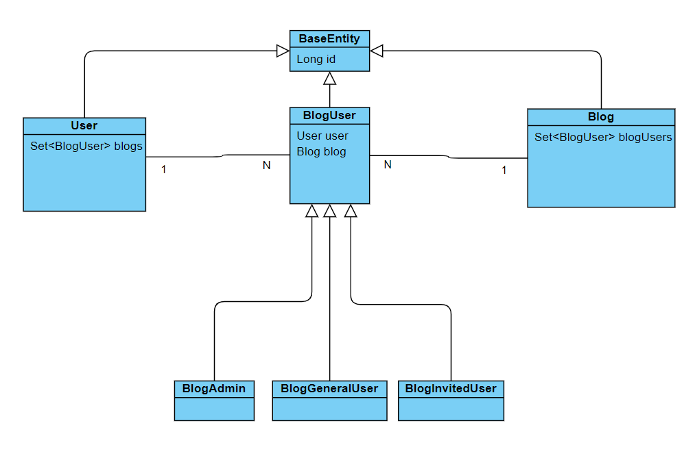
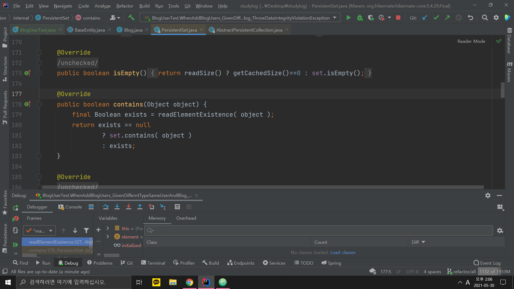

'자바 ORM 표준 JPA 프로그래밍 - 김영한' 책을 읽으며

Hibernate 를 사용하는 프로젝트를 진행하다  

Java Set Collection 의 <code>contains</code> 메소드가 예상 밖의 결과를 내놓는 것을 확인하여 매우 당황하였다

### 발단

내 프로젝트는 유저와 블로그 다대다 관계를 맺고 있었고

다대다 관계를 1대다 다대1 관계로 풀었다



그리고 블로그을 생성 기능을 위한 로직을 작성하니

1. 트랜잭션 시작
2. 블로그를 생성한다
3. 블로그의 관리자를 추가한다
4. 블로그를 <code>EntityManager</code>에 영속한다 (저장한다)
5. 블로그의 유저들을 추가한다
6. 트랜잭션 커밋한다 (flush)

문제는 5번에서 진행하면서 중복된 유저가 있으면

<code>Set</code> 의 특징으로 인해 무시되지만

추가 하기전에 <code>contains</code> 메소드를 호출하여 중복 검사를 한 번하고

사용자에게 잘못되었다고 알리고 싶었다

```java
@Entity
public class Blog extends BaseEntity {
    @OneToMany(mappedBy = "blog", cascade = CascadeType.PERSIST)
    private Set<BlogUser> blogUsers = new HashSet<>();

    // 다른 필드, 생성자, getters

    public void addBlogUser(BlogUser blogUser) {
        if (blogUsers.contains(blogUser)) { // 유저가 중복되는지 검사
            throw new DataIntegrityViolationException("블로그 유저가 중복됩니다");
        }
        blogUsers.add(blogUser);
    }
}
```

그리고 <code>contains</code> 가 올바르게 작동되도록

블로그 유저들은 <code>Object</code> 클래스의 <code>equals</code> 와 <code>hashCode</code> 메소드를 재정의하였고

```java
@Entity
@Inheritance(strategy = InheritanceType.SINGLE_TABLE)
@DiscriminatorColumn(name = "auth_type")
public abstract class BlogUser extends BaseEntity {
    @ManyToOne
    @JoinColumn(name = "user_id", nullable = false, updatable = false)
    private User user;

    @ManyToOne
    @JoinColumn(name = "blog_id", nullable = false, updatable = false)
    private Blog blog;

    BlogUser() {

    }

    protected BlogUser(User user, Blog blog) {
        this.user = user;
        this.blog = blog;
    }

    // getter

    @Override
    public boolean equals(Object o) {
        if (this == o) return true;
        if (!(o instanceof BlogUser)) return false;
        BlogUser blogUser = (BlogUser) o;
        return user.equals(blogUser.getUser()) && blog.equals(blogUser.getBlog());
    }

    @Override
    public int hashCode() {
        return Objects.hash(user, blog);
    }
}
```

유저와 블로그는 <code>equals</code> 와 <code>hashCode</code> 메소드를 재정의하지 않고

부모 클래스인 <code>BaseEntity</code> 클래스의 <code>equals</code> 와 <code>hashCode</code> 메소드 사용하도록 의도하였다


```java
@MappedSuperclass
public abstract class BaseEntity {
    @Id
    @GeneratedValue(strategy = GenerationType.IDENTITY)
    private Long id;

    BaseEntity() {

    }

    protected BaseEntity(Long id) {
        this.id = id;
    }

    public Long getId() {
        return id;
    }

    @Override
    public boolean equals(Object o) {
        if (this == o) return true;
        if (o == null || getClass() != o.getClass()) return false;
        BaseEntity that = (BaseEntity) o;
        return id.equals(that.id);
    }

    @Override
    public int hashCode() {
        return Objects.hash(id);
    }
}
```

### 테스팅
```java
public class BlogUserTest {
    @Test
    @Transactional
    public void WhenAddBlogUsers_GivenDifferntTypeSameUserAndBlog_ThrowDataIntegrityViolationException() {
        User user = new User("name", "nick", "email", null);
        userDao.save(user);

        Blog blog = new Blog("test", null);
        blog.addBlogUser(new BlogAdmin(user, blog));
        blogDao.save(blog);

        try {
            blog.addBlogUser(new BlogInvitedUser(user, blog));
            assert false;
        } catch (DataIntegrityViolationException dataIntegrityViolationException) {
            assert true;
        }
    }
}
```

나는 <code>BlogUser</code> 의 자식 클래스들이 다른 타입이더라도

(자식 클래스들은 <code>contains</code>와 <code>hashCode</code> 재정의하지 않았다)

<code>BlogUser</code> 의 <code>contains</code>와 <code>hashCode</code> 를 사용하기 때문에

다른 타입이더라도 내용물이 같은 <code>BlogUser</code> 자식의 객체면

블로그 유저를 추가할때 <code>contains</code> 메소드때문에 예외가 발생한다고 예상했다

그러나 저 테스팅은 실패했다

왜? 분명 내용물은 같은 유저 객체와 같은 블로그 객체로 넣어주었는데 무엇이 잘못 되었지?

책에서 Hibernate가 Java Collection 객체들을 PersistentBag 객체로 관리해서 때문인가?

때문에 직접 디버깅해보았다



그러나 <code>PersistentSet</code> 의 <code>contains</code> 메소드는

부모 추상 클래스인 <code>AbstractPersistenCollection</code> 의 <code>readElementExistence</code> 메소드를 통해  

현재 자신이 영속되있지 않는 상태면 로딩하여 조회하고

영속되있다면 <code>null</code> 을 반환하여

181번째 줄인 <code>set.contains( Object )</code> 를 실행한다

결국 <code>Set</code> 클래스의 <code>contains</code> 클래스를 실행한다

### 테스팅2

그러면 애초에 블로그에 담겨 있는 유저를 꺼내서 직접 비교해보았다

```java
@Test
@Transactional
public void WhenAddBlogUsers_GivenDifferntTypeSameUserAndBlog_ThrowDataIntegrityViolationException() {
    User user = new User("name", "nick", "email", null);
    userDao.save(user);

    Blog blog = new Blog("test", null);
    blog.addBlogUser(new BlogAdmin(user, blog));
    blogDao.save(blog);

    Assert.assertEquals(blog.getBlogUsers().iterator().next(), new BlogInvitedUser(user, blog));
    Assert.assertEquals(blog.getBlogUsers().iterator().next().hashCode(), new BlogInvitedUser(user, blog).hashCode());
    System.out.println(blog.getBlogUsers().contains(new BlogInvitedUser(user, blog))); // false
}
```

테스팅 결과는 뭔가 이상했다

내가 의도한대로 <code>BlogUser</code> 클래스의 자식클래스들의 비교는 통과하였지만

마지막 <code>contains</code> 메소드의 결과가 false 인 것이다

나는 <code>HashSet</code> 클래스가 내부적으로 <code>HashMap</code> 객체를 통해서 구현되있다는 것을 알고 있었다

때문에 직접 객체를 꺼내서 비교하였을 때는 통과하는데 <code>contains</code> 메소드만 실행하면 안된다  

????????????????????

### 원인 분석

테스팅하다 알게 되었는데 블로그를 맨마지막에 영속하면 <code>contains</code> 메소드가 잘 작동된다

그리고 원인을 찾기 위해 구글링을 하던 도중 나와 정말로 비슷한 사례의 포스팅을 보게 잘못되었다

>[[삽질 로그] JPA의 Set 연관 관계에서 contains와 remove가 고장나는 문제](https://velog.io/@woodyn1002/%EC%82%BD%EC%A7%88-%EB%A1%9C%EA%B7%B8-JPA%EC%9D%98-Set-%EC%97%B0%EA%B4%80-%EA%B4%80%EA%B3%84%EC%97%90%EC%84%9C-contains%EC%99%80-remove%EA%B0%80-%EA%B3%A0%EC%9E%A5%EB%82%98%EB%8A%94-%EB%AC%B8%EC%A0%9C)

분명 원인은 블로그를 영속하기 전과 후로 나뉜다

블로그를 영속하고 나면 무엇이 달라지지?

유저는 미리 영속하였기 때문에 같다

그러나 블로그는 영속하고 전과 후로 나뉘기 때문에

부모 클래스인 <code>BaseEntity</code> 가 가지고 있는 id 값이 달라진다

그럼 해쉬코드도 달라지는가? 달라진다

그러나 영속되어있는 블로그 안에 담겨있는 블로그 유저도 같이 달라진다

그렇기 때문에 직접 꺼냈을 때 비교하여도 똑같다

그럼 무엇이 문제인가

### 내가 놓쳤던 것

허무하게도 나는 한 가지 딱 한가지를 놓쳤던 것이 있었다

바로 영속하고 전과 후 해쉬코드가 달라지지만

블로그의 <code>Set</code> 내부의 <code>HashMap</code> 은 달라지나?

달라지지 않는다

당연한 이야기다

영속과 관계없이 그저 <code>put</code> 을 실행한다

그렇기 때문에 이전에 담겨있던 <code>BlogAdmin</code> 객체를 추가할 시기에는

**영속 되기전 해시코드값** 으로 <code>put</code> 한다

그리고 <code>Set</code> 의 <code>contains</code> 메소드를 실행하게 되면

**영속 된 후 해시코드값** 으로 <code>HashMap</code> 에 있는 조회한다

따라서 영속된 후 해시코드값으로 조회하기때문에 <code>false</code> 가 출력된다

### 해결

따라서 해결 방안은

1. 블로그를 맨마지막에 영속하거나
2. 블로그 유저를 영속하면서 추가하면 되지만

객체 관리의 중요성에 대해 알게 된

삽질의 시간이었다

무엇인가 사소한 것 같으면서

막상 해결하니 기쁘면서도 찝찝한 기분이다

주저리주저리 쓴 글 읽어주셔서 감사합니다
